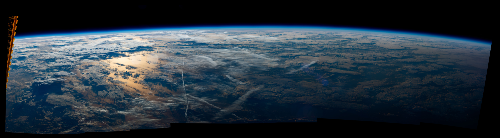

# node-cupola-bot
The Overview Effect courtesy of the International Space Station's Cupola using Mapbox & NASA's VIIRS imagery!

### WHAT IS THIS?

### HOW DOES IT WORK?

* Get the current location of the International Space Station from http://open-notify.org/Open-Notify-API/ISS-Location-Now/
* Calculate sunrise/sunset times for the ISS location using mourner's [SunCalc package](https://github.com/mourner/suncalc)
* Next, get an image from the Mapbox Static API...
  * If it's day time, use the basic Mapbox Satellite imagery.
  * If it's night time, use a custom Mapbox style made w/ NASA's Suomi NPP VIIRS night lights imagery.
* Overlay a transparent cupola window image on top of the satellite image.
* And voila, the Overview Effect! 

In order to get night lights imagery from the Mapbox Static API, you have to do a little bit of map/imagery processing up front...

* First, download a .geotiff of the VIIRS DNB imagery from [NASA's Visible Earth](https://visibleearth.nasa.gov/view.php?id=79765)
* Reproject the .geotiff into Web Mercator (EPS:3857) using GDAL ([how to guide](https://tilemill-project.github.io/tilemill/docs/guides/reprojecting-geotiff/)).
* Then, upload the .geotiff as a [tileset data source](https://www.mapbox.com/help/uploads/) in a new map style using Mapbox Studio. 
* And last, just copy the map style ID and you're ready to go!

### HOW TO RUN

The project is set up to run either locally or as a Lambda function (as a Twitter bot). To run locally, you'll need to create a config.js file with your own Mapbox access token, and Twitter credentials if needed. If no Twitter credentials are included in config.js, it'll still save an image locally.

~~~~
module.exports = {
  mapbox_token: '[MAPBOX_ACCESS_TOKEN]',
}
~~~~

Once you have your config.js file, you should just be able to run the main index.js file.

~~~~
node index.js
~~~~

A new cupola image should then save to the tmp directory. Enjoy!
