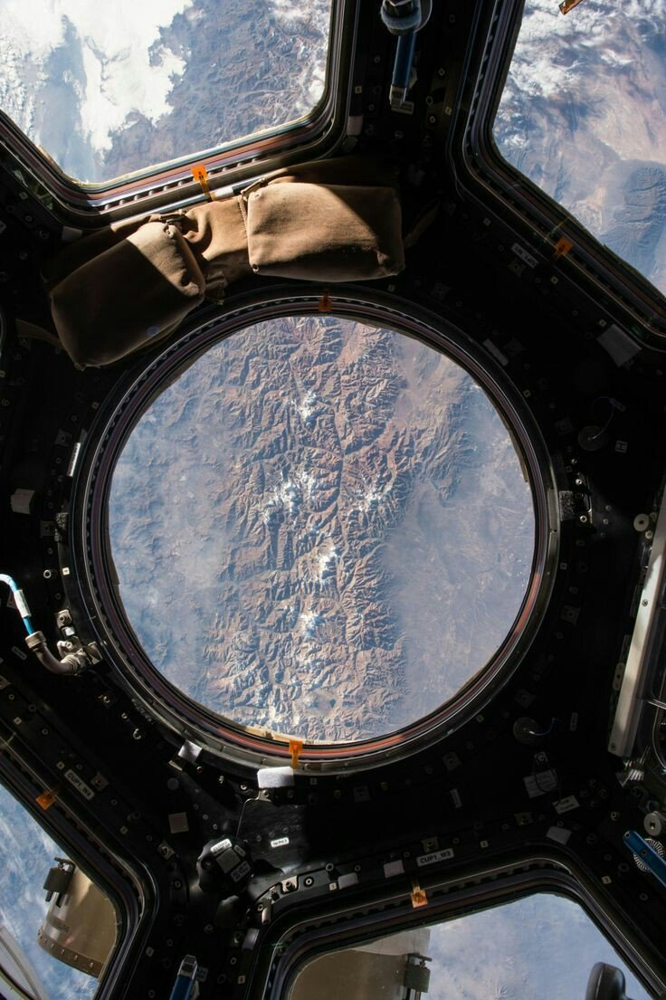

# node-cupola-bot
The Overview Effect on Twitter, courtesy of the International Space Station's Cupola module using Mapbox & NASA's VIIRS imagery.

### WHAT IS THIS?

Cupola Bot does its best to simulate the Overview Effect from the perspective of the cupola module on the International Space Station (ISS). Every 30 minutes (3 times an orbit), it tweets an image of the Earth at the current location of the real ISS, night or day!

### WHY DID YOU MAKE THIS?

This is a photo of the Earth taken from the [International Space Station's (ISS) Cupola module](https://en.wikipedia.org/wiki/Cupola_(ISS_module)), a large windowed observatory added to the ISS in 2010. It offers a [unique and beautiful perspective of the Earth](https://www.youtube.com/watch?v=xngkqPovLu8) for astronauts on the ISS, a view I heart-achingly wish I could experience for myself.

But I'd also been thinking lately about satellite imagery and its impact on humankind. We're in this fascinating era of increasingly ubiquituous access to space and space data, and I've been trying to think about its longterm impact on human life, culture and society. The cupola photo above reminded me of the [Overview Effect phenomenon](https://vimeo.com/55073825), the concept that views from outerspace have a transformative ability to positively alter someone's perspective of the planet and humankind.  

So I decided to try and create my own Overview Effect in the form of a Twitter bot!

### HOW DOES IT WORK?

To do that, it does the following...

* Get the current location of the International Space Station from http://open-notify.org/Open-Notify-API/ISS-Location-Now/
* Calculate sunrise/sunset times for the ISS location using mourner's [SunCalc package](https://github.com/mourner/suncalc)
* Next, get an image from the Mapbox Static API...
  * If it's day time, use the basic Mapbox Satellite imagery.
  * If it's night time, use a custom Mapbox style made w/ NASA's Suomi NPP VIIRS night lights imagery.
* Overlay a transparent cupola window image on top of the satellite image.
* And voila, the Overview Effect! 

In order to get night lights imagery from the Mapbox Static API, you have to do a little bit of map/imagery processing up front...

* First, download a .geotiff of the VIIRS DNB imagery from [NASA's Visible Earth](https://visibleearth.nasa.gov/view.php?id=79765)
* Reproject the .geotiff into Web Mercator (EPS:3857) using GDAL ([how to guide](https://tilemill-project.github.io/tilemill/docs/guides/reprojecting-geotiff/)).
* Then, upload the .geotiff as a [tileset data source](https://www.mapbox.com/help/uploads/) in a new map style using Mapbox Studio. 
* And last, just copy the map style ID and you're ready to go!

### RUN THE BOT

The project is set up to run either locally or as a Lambda function (as a Twitter bot). To run locally, you'll need to create a config.js file with your own Mapbox access token, and Twitter credentials if needed. If no Twitter credentials are included in config.js, it'll still save an image locally in the tmp folder.

~~~~
module.exports = {
  mapbox_token: '[MAPBOX_ACCESS_TOKEN]',
}
~~~~

Once you have your config.js file, you should just be able to run the main index.js file.

~~~~
node index.js
~~~~

A new cupola image should then save to the tmp folder. Hope you enjoy the view!
